# Simulação de florestas

Em computação, simulação consiste em empregar formalizações em computadores, tais como expressões matemáticas ou especificações mais ou menos formalizadas, com o propósito de imitar um processo ou operação do mundo real. Desta forma, para ser realizada uma simulação, é necessário construir um modelo computacional que corresponda à situação real que se deseja simular.

## Em floresta nativa

- Mortalidade

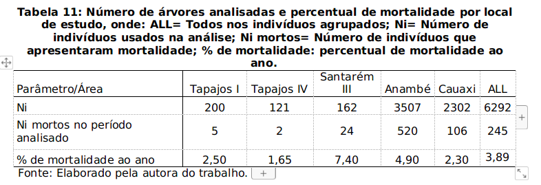

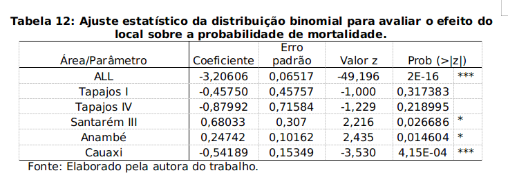

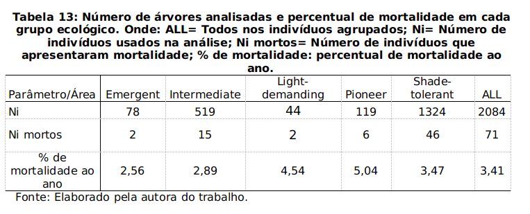

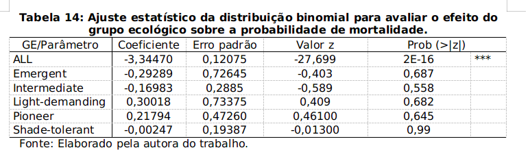

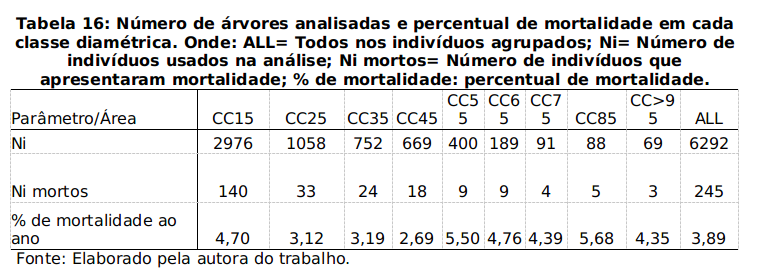

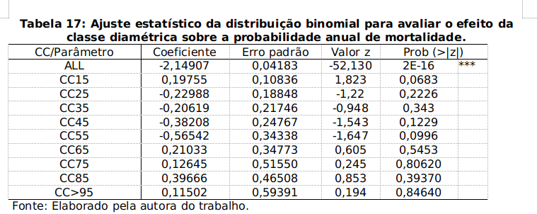

- Crescimento

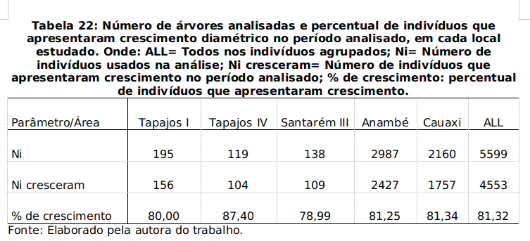

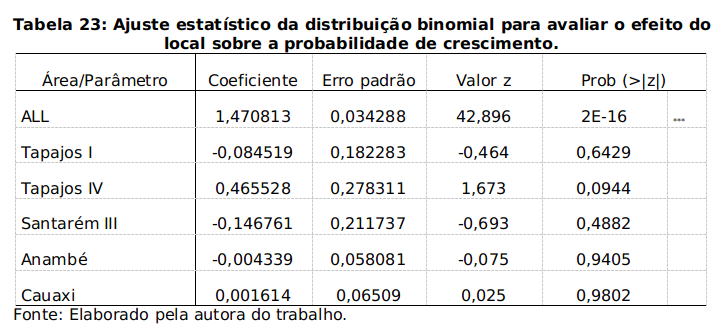

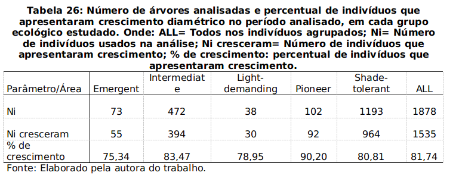

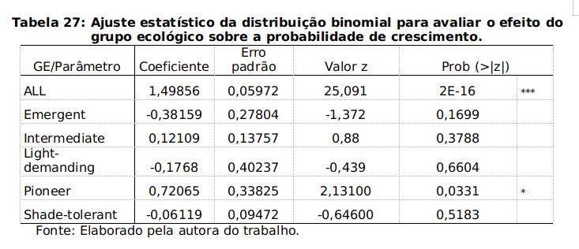

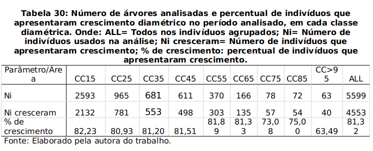

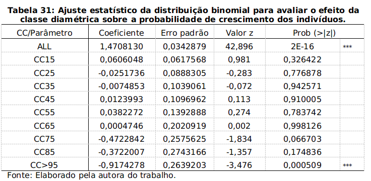

- Incremento

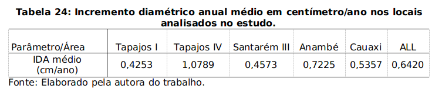

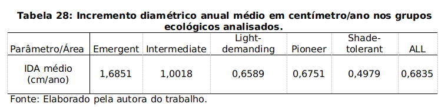

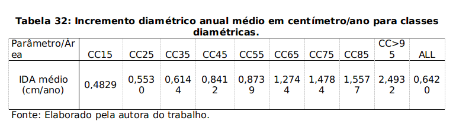

- Ingresso

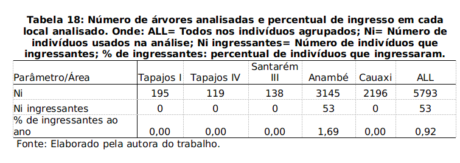

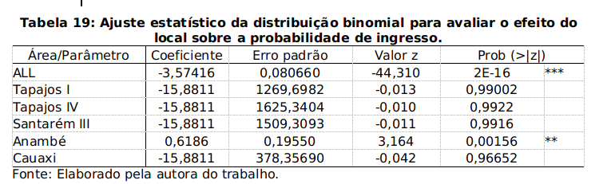

## Exemplos de simulador

- **nativas**: simulador em python de uma parcela de floresta nativa: http://www.codeskulptor.org/#user44_IBg4hqgv85_21.py
- **plantadas**: simulador em python dos talhões florestais de uma empresa: http://www.codeskulptor.org/#user40_zewIk91Bnr_1.py
