# Simulação de florestas

## Floresta nativa

- Mortalidade

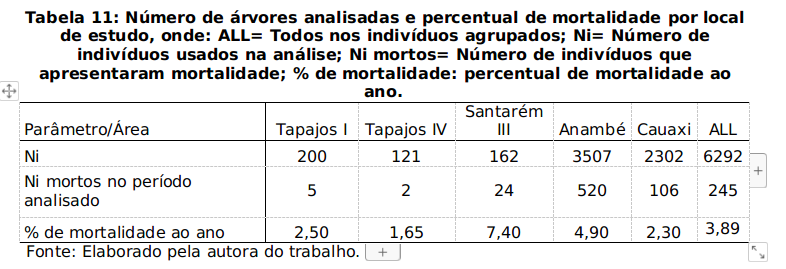

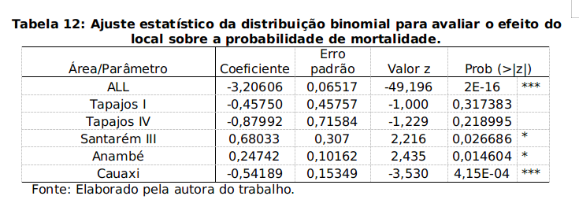

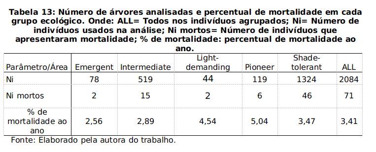

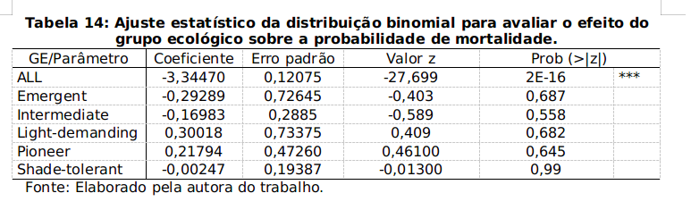

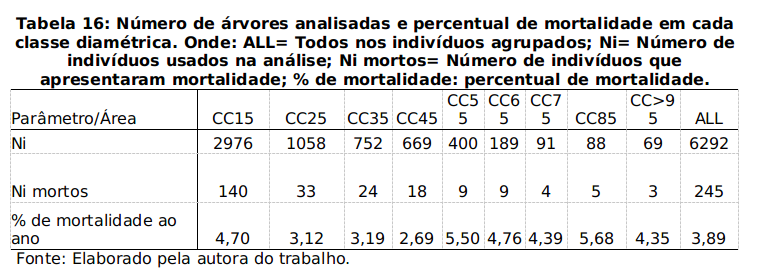

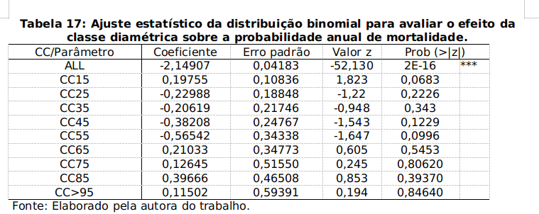

- Crescimento

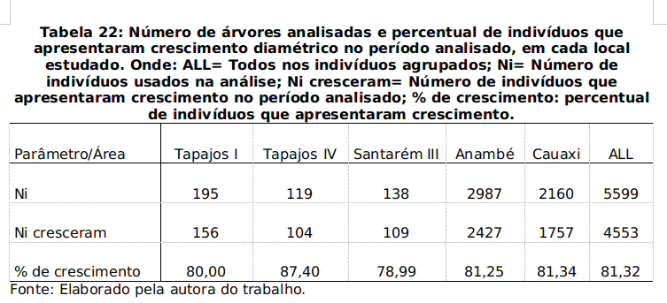

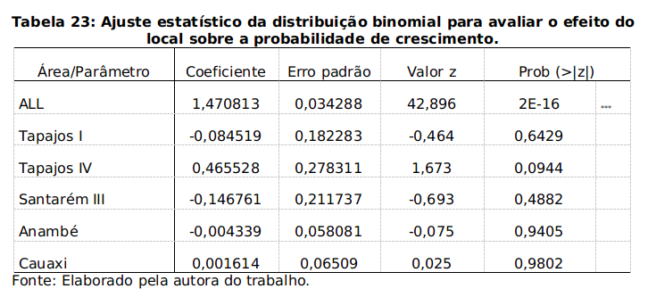

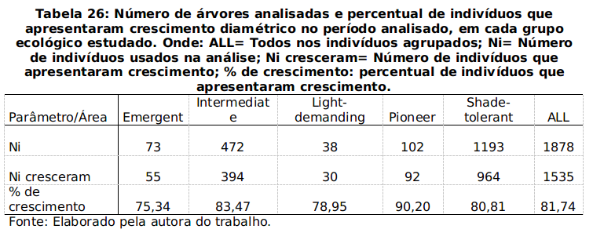

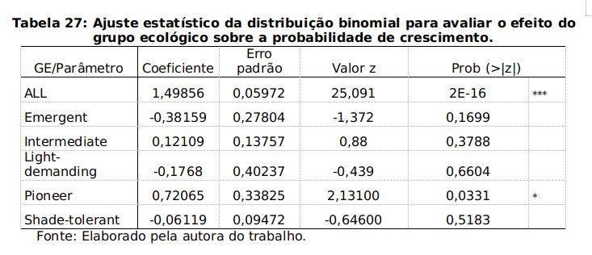

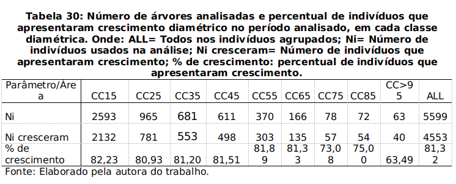

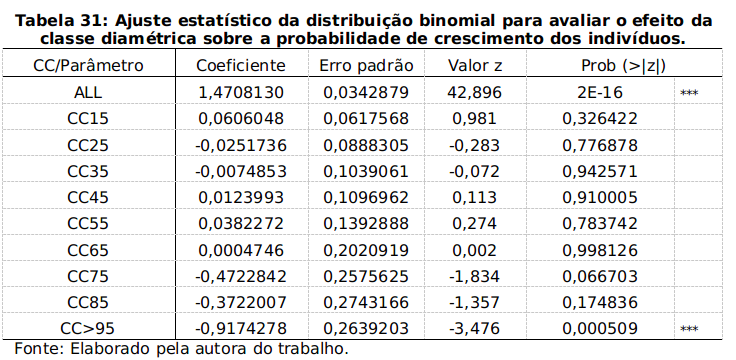

- Incremento

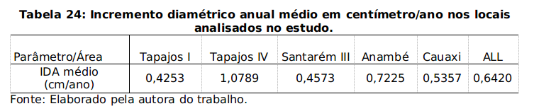

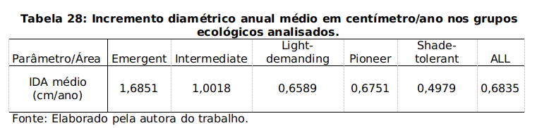

- Ingresso

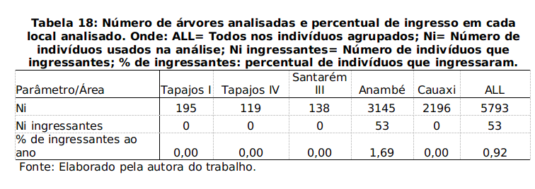

## Floresta plantada

## Exemplos de simulador

- **nativas**: simulador em python de uma parcela de floresta nativa: http://www.codeskulptor.org/#user44_IBg4hqgv85_21.py
- **plantadas**: simulador em python dos talhões florestais de uma empresa: http://www.codeskulptor.org/#user40_zewIk91Bnr_1.py
