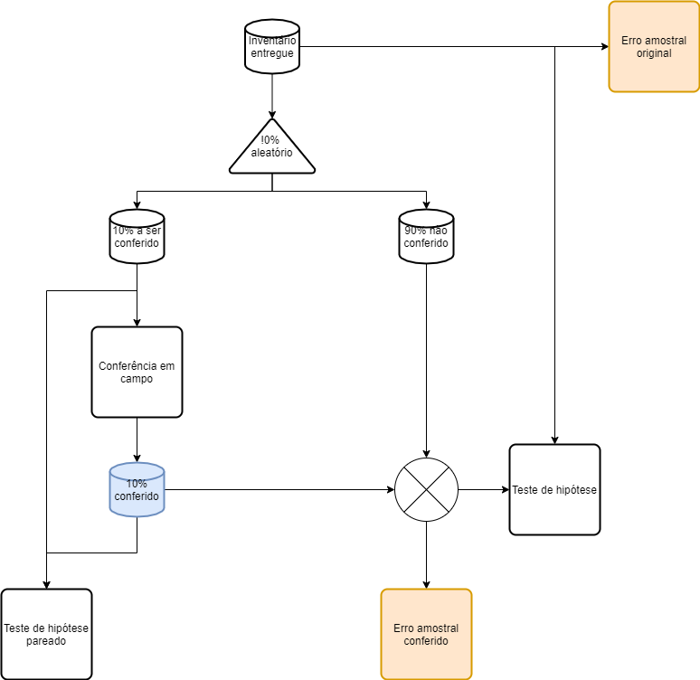

## Introdução

This is an R Markdown document. Markdown is a simple formatting syntax for authoring HTML, PDF, and MS Word documents. For more details on using R Markdown see <http://rmarkdown.rstudio.com>.

When you click the **Knit** button a document will be generated that includes both content as well as the output of any embedded R code chunks within the document. You can embed an R code chunk like this:

## Material e métodos

```{r packages, echo=FALSE}

require(ggplot2)
require(dplyr)
require(forestmangr)

```

Fluxograma das opções de conferência analisadas....



Procedimento para simulação de floresta baseada em https://www.revistaespacios.com/a17v38n23/a17v38n23p13.pdf....

```{r florestaSimulada, echo=FALSE}
nparcelas = 30                                                                  # número de parcelas na simulação
area = 10000                                                                    # área da parcela em metros quadrados 
  
VFCC = function(dap){                                                           # modelo para estimar o volume
  return(0.0233768+
           0.00730236*dap-
           0.000430709*dap^2+
           0.0000233749*dap^3)
}

inventario = data.frame(parcela = integer(),
                              arvore = integer(),
                              dap = double(),
                              vol = double())

# calcular distribuição diamétrica

for(i in seq(nparcelas)){                                                       # gera parcelas aleatórias
  n = ceiling(rnorm(1, 545, 50))
  arvore = seq(n)
  dap = rweibull(n, 2.5, 7)
  vol = VFCC(dap)
  parcela = rep(i, n)
  temp = data.frame(parcela, arvore, dap, vol)
  inventario = rbind(inventario, temp)
}

inventario = subset(inventario, dap >= 5)
intervaloClasse = 1
inventario$centroClasse = floor(inventario$dap / intervaloClasse) * intervaloClasse + (intervaloClasse/2)
                                                                                           
rm(n, arvore, dap, vol, parcela, temp, i, intervaloClasse)
```

Simula um desvio com disitribuição normal de média variando entre X e Y, e desvio padrão variando entre X e Y...

```{r checkDAP, echo=FALSE}
variacaoErroMedio = seq(0, 1, 0.1)
variacaoDesvMedio = seq(0.01, 1, 0.05)

erroMedio = c()
desvPadMedio = c()

for(m in variacaoErroMedio){
  for(d in variacaoDesvMedio){
      erroMedio = append(erroMedio, m)
      desvPadMedio = append(desvPadMedio, d)
  }
}

simulado = data.frame(erroMedio,
                      desvPadMedio,
                      t_pvalue = 0,
                      ks_pvalue = 0)
simuladoPlot = data.frame(erroMedio,
                          desvPadMedio,
                          graybill = 0,
                          erroInv = 0,
                          erroInvConf = 0,
                          erroInvProp = 0)
for(m in variacaoErroMedio){
  for(d in variacaoDesvMedio){
    t_pvalue = c()
    ks_pvalue = c()
    graybill = c()
    erroInv = c()
    erroInvConf = c()
    erroInvProp = c()
    i = 1
    #for(i in seq(100)){
      # sorteia parcelas que serão conferidas pelo órgão
      parcSorteadas = sample(seq(nparcelas), 0.1*nparcelas)
      conferencia = subset(inventario, 
                           parcela %in% parcSorteadas)
      `%notin%` = Negate(`%in%`)
      naoConferencia = subset(inventario, 
                           parcela %notin% parcSorteadas)
      
      # simula dados conferidos a partir de media e desvio desejado
      mediaDesvio = m
      desvPadDesvio = d
      desvio = rnorm(dim(conferencia)[1], mediaDesvio, desvPadDesvio)           # gera desvio aleatório
      conferencia$dapConferencia = conferencia$dap + desvio
      conferencia$volConferencia = VFCC(conferencia$dapConferencia)
      
      # calcula diferença média estre original e conferido
      temp = conferencia %>% 
        group_by(parcela) %>%
        summarise(meanDap = mean(dap), meanDapCon = mean(dapConferencia))
      difMedia = mean(temp$meanDapCon - temp$meanDap)
      temp = conferencia %>% 
        group_by(parcela) %>%
        summarise(sdDap = sd(dap), sdDapCon = sd(dapConferencia))
      difDesvio = mean(temp$sdDapCon - temp$sdDap)
      
      # junta parcelas conferidas com parcelas não conferidas
      temp = conferencia %>% mutate(vol = volConferencia,
                                    dap = dapConferencia) %>%
        select(parcela, arvore, dap, vol, centroClasse)
      inventarioComConferido = rbind(naoConferencia, temp)
      
      # cria base de inventário com erro observado na conferência
      inventarioPropagado = inventario
      inventarioPropagado$dap = inventario$dap + rnorm(dim(inventario)[1], difMedia, difDesvio)
      inventarioPropagado$vol = VFCC(inventarioPropagado$dap)
      
      # processa inventarios
      totalizacaoInv = plot_summarise(inventario, "parcela", plot_area = area, dbh = "dap", vwb = 'vol')
      erroInv[i] = sprs(totalizacaoInv, 'vol_ha', 'plot_area', total_area = 1)[12,2]
      
      totalizacaoInvCom = plot_summarise(inventarioComConferido, "parcela", plot_area = area, dbh = "dap", vwb = 'vol')
      erroInvConf[i] = sprs(totalizacaoInvCom, 'vol_ha', 'plot_area', total_area = 1)[12,2]
      
      totalizacaoInvProp = plot_summarise(inventarioPropagado, "parcela", plot_area = area, dbh = "dap", vwb = 'vol')
      erroInvProp[i] = sprs(totalizacaoInvProp, 'vol_ha', 'plot_area', total_area = 1)[12,2]
      
      # realiza teste t entre original e conferido
      t_pvalue[i] = as.numeric(t.test(conferencia$dap, 
                                      conferencia$dapConferencia, 
                                      paired = TRUE)[3])
      
      # realiza teste KS entre original e conferido
      ks_pvalue[i] = as.numeric(ks.test(conferencia$dap, 
                                        conferencia$dapConferencia)[2])
      
      # totaliza parcela para volume
      # realiza teste graybill entre original e conferido
      volPlot = conferencia %>% 
        group_by(parcela) %>%
        summarise(volOrig = sum(vol)*(area/10000), volConf = sum(volConferencia)*(area/10000))
      graybill[i] = as.numeric(graybill_f(volPlot, 'volOrig', 'volConf')[3])
    #}
    
    simulado[simulado$erroMedio == m & 
               simulado$desvPadMedio == d, 3] = mean(t_pvalue)
    simulado[simulado$erroMedio == m & 
               simulado$desvPadMedio == d, 4] = mean(ks_pvalue)
    simuladoPlot[simuladoPlot$erroMedio == m & 
               simuladoPlot$desvPadMedio == d, 3] = mean(graybill)
    simuladoPlot[simuladoPlot$erroMedio == m & 
               simuladoPlot$desvPadMedio == d, 4] = mean(erroInv)
    simuladoPlot[simuladoPlot$erroMedio == m & 
               simuladoPlot$desvPadMedio == d, 5] = mean(erroInvConf)
    simuladoPlot[simuladoPlot$erroMedio == m & 
               simuladoPlot$desvPadMedio == d, 6] = mean(erroInvProp)
  }
}

rm(i, m, d, erroMedio, desvPadMedio, conferencia, t_pvalue, graybill,
   ks_pvalue, desvio, desvPadDesvio, mediaDesvio, variacaoDesvMedio,
   variacaoErroMedio)
```

## Resultados

Distribuição diamétrica....

```{r distDiametrica}

freqDiam = inventario %>% 
  group_by(parcela, centroClasse) %>%
  summarise(freq = n()*(area/10000)) %>%
  group_by(centroClasse) %>%
  summarise(freq = sum(freq)/nparcelas)

ggplot(freqDiam, aes(centroClasse, freq)) + geom_col()
```

Resultado simulação na perspectiva de teste de médias pareado...

```{r plotTestet, echo = FALSE}
ggplot(simulado, aes(erroMedio, desvPadMedio, z = t_pvalue)) + 
  geom_contour_filled() + ylab('Desvio padrão da diferença (cm)') +
  xlab('Diferença média do DAP (cm)')
  
```

Resultado simulação na perspectiva de teste de distribuição....

```{r plotKs, echo = FALSE}
ggplot(simulado, aes(erroMedio, desvPadMedio, z = ks_pvalue)) + 
  geom_contour_filled() + ylab('Desvio padrão da diferença (cm)') +
  xlab('Diferença média do DAP (cm)')
```

Resultado simulação na perspectiva de teste de F de Graybill em nível de parcela

```{r plotKs, echo = FALSE}
ggplot(simuladoPlot, aes(erroMedio, desvPadMedio, z = graybill)) + 
  geom_contour_filled() + ylab('Desvio padrão da diferença (cm)') +
  xlab('Diferença média do DAP (cm)')
```


## Discussão

Comparação em nível de árvore e em nível de parcela...

Caminho mais lógico...

Análise laranja... perceber se o erro obtido na conferência de 10% será diluído no erro amostral....

Análise vermelha... o conceito é de que o erro que ocorre nos 10% ocorrerá em todo o inventário...

O erro pode vir dos dois lados....

## Referências

Incluir: https://www.revistaespacios.com/a17v38n23/a17v38n23p13.pdf
