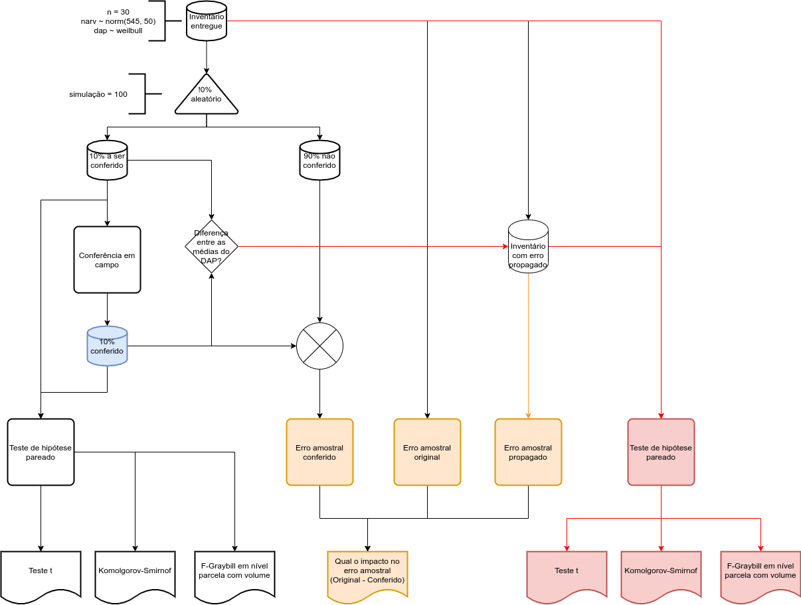

## Introdução

This is an R Markdown document. Markdown is a simple formatting syntax for authoring HTML, PDF, and MS Word documents. For more details on using R Markdown see <http://rmarkdown.rstudio.com>.

When you click the **Knit** button a document will be generated that includes both content as well as the output of any embedded R code chunks within the document. You can embed an R code chunk like this:

## Material e métodos

```{r packages, echo=FALSE}

require(ggplot2)

```

Fluxograma das opções de conferência analisadas....



Procedimento para simulação de floresta baseada em https://www.revistaespacios.com/a17v38n23/a17v38n23p13.pdf....

```{r florestaSimulada, echo=FALSE}
nparcelas = 30                                                                  # número de parcelas na simulação

VFCC = function(dap){                                                           # modelo para estimar o volume
  return(0.0233768+
           0.00730236*dap-
           0.000430709*dap^2+
           0.0000233749*dap^3)
}

inventario = data.frame(parcela = integer(),
                              arvore = integer(),
                              dap = double(),
                              vol = double())
for(i in seq(nparcelas)){                                                       # gera parcelas aleatórias
  n = ceiling(rnorm(1, 545, 50))
  arvore = seq(n)
  dap = rweibull(n, 2.5, 7)
  vol = VFCC(dap)
  parcela = rep(i, n)
  temp = data.frame(parcela, arvore, dap, vol)
  inventario = rbind(inventario, temp)
}
rm(n, arvore, dap, vol, parcela, temp)
```

Simula um desvio com disitribuição normal de média variando entre X e Y, e desvio padrão variando entre X e Y...

```{r checkDAP, echo=FALSE}
variacaoErroMedio = seq(-1, 1, 0.1)
variacaoDesvMedio = seq(0.01, 1, 0.05)

erroMedio = c()
desvPadMedio = c()

for(m in variacaoErroMedio){
  for(d in variacaoDesvMedio){
      erroMedio = append(erroMedio, m)
      desvPadMedio = append(desvPadMedio, d)
  }
}
simulado = data.frame(erroMedio,
                      desvPadMedio,
                      t_pvalue = 0,
                      ks_pvalue = 0)
for(m in variacaoErroMedio){
  for(d in variacaoDesvMedio){
    t_pvalue = c()
    ks_pvalue = c()
    for(i in seq(100)){
      conferencia = subset(inventario, 
                           parcela %in% sample(seq(nparcelas), 0.1*nparcelas))
      mediaDesvio = m
      desvPadDesvio = d
      desvio = rnorm(dim(conferencia)[1], mediaDesvio, desvPadDesvio)           # gera desvio aleatório
      conferencia$dapConferencia = conferencia$dap + desvio
      
      t_pvalue[i] = as.numeric(t.test(conferencia$dap, 
                                      conferencia$dapConferencia, 
                                      paired = TRUE)[3])
      ks_pvalue[i] = as.numeric(ks.test(conferencia$dap, 
                                        conferencia$dapConferencia)[2])
    }
    simulado[simulado$erroMedio == m & 
               simulado$desvPadMedio == d, 3] = mean(t_pvalue)
    simulado[simulado$erroMedio == m & 
               simulado$desvPadMedio == d, 4] = mean(ks_pvalue)
  }
}
rm(i, m, d, erroMedio, desvPadMedio, conferencia, t_pvalue, ks_pvalue, desvio,
   desvPadDesvio, mediaDesvio, variacaoDesvMedio, variacaoErroMedio)
```

Note that the `echo = FALSE` parameter was added to the code chunk to prevent printing of the R code that generated the plot.

## Resultados

Resultado simulação na perspectiva de teste de médias pareado...

```{r plotTestet, echo = FALSE}
ggplot(simulado, aes(erroMedio, desvPadMedio, z = t_pvalue)) + 
  geom_contour_filled()
```

Resultado simulação na perspectiva de teste de distribuição....

```{r plotKs, echo = FALSE}
ggplot(simulado, aes(erroMedio, desvPadMedio, z = ks_pvalue)) + 
  geom_contour_filled()
```


## Discussão


## Referências

Incluir: https://www.revistaespacios.com/a17v38n23/a17v38n23p13.pdf